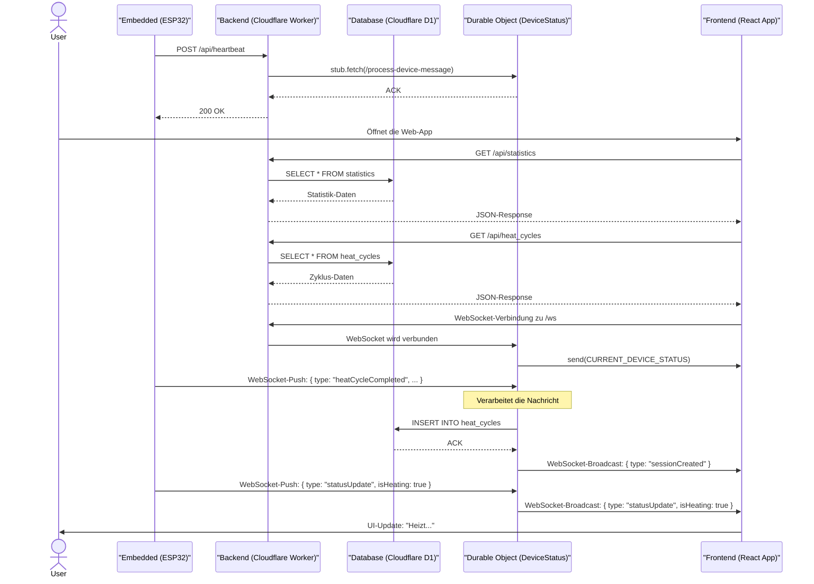

# Technische Spezifikation: Heizbox-System

Dieses Dokument beschreibt die technische Architektur und die Kommunikationsflüsse des Heizbox-Projekts. Es dient als Grundlage für die Entwicklung und das Verständnis der Interaktionen zwischen dem ESP32-basierten Induktionserhitzer, dem Cloudflare-Backend und dem React-Frontend.

## 1. Systemarchitektur

Das System besteht aus drei Hauptkomponenten, die über ein Cloudflare-basiertes Backend miteinander kommunizieren.

-   **ESP32-Firmware:** Das Herzstück des physischen Geräts. Es steuert den Heizprozess, verarbeitet Benutzereingaben und kommuniziert über WLAN mit dem Backend.
-   **Cloudflare-Backend:** Eine Serverless-Anwendung, die als API-Gateway, Datenverarbeiter und Echtzeit-Kommunikationsknotenpunkt dient. Es nutzt Hono für das Routing, Cloudflare D1 als Datenbank und Durable Objects für die Zustandsverwaltung in Echtzeit.
-   **React-Frontend:** Eine Webanwendung zur Visualisierung von Daten, zur Anzeige des Gerätestatus in Echtzeit und zur Analyse von Nutzungsstatistiken.

### 1.1. Architektur- und Kommunikationsdiagramm (MermaidJS)

Das folgende Diagramm kann von einer KI oder einem Mermaid-Renderer in eine visuelle Darstellung umgewandelt werden. Es zeigt den detaillierten Ablauf eines vollständigen Heizzyklus und die Interaktion der Komponenten.

## 2. Komponenten im Detail

### 2.1. ESP32 Firmware (`apps/esp32`)

Die ESP32-Firmware ist die embedded Software, die auf dem Heizgerät läuft. Sie ist verantwortlich für die gesamte Hardware-Steuerung, die Benutzerschnittstelle und die Kommunikation mit dem Cloud-Backend.

-   **Hardware:** ESP32-Dev-Board, ST7789-Farbdisplay, 5-Wege-Joystick, ZVS-Induktionsheizmodul.
-   **Software:** C++ im Arduino-Framework, verwaltet über das PlatformIO-Ökosystem.

-   **Hardware-Abstraktion & Konfiguration:**
    -   **Pin-Definitionen:** Um die Portabilität des Codes zu gewährleisten, wird die gesamte Pin-Belegung für das Display (TFT_MOSI, TFT_SCLK etc.) und den Heiz-Controller (MOSFET_PIN) nicht im Code festgeschrieben. Stattdessen wird sie zentral über `build_flags` in der `platformio.ini`-Datei definiert. Dies ermöglicht eine einfache Anpassung an unterschiedliche Platinenlayouts.
    -   **Statische Konfiguration:** Wichtige, zur Kompilierzeit bekannte Werte wie die `DEVICE_ID` und die `BACKEND_WS_URL` für die Backend-Kommunikation sind in der `include/config.h`-Datei ausgelagert.

-   **Datenpersistenz (NVS):**
    -   Um wichtige Daten über Neustarts und Stromausfälle hinweg zu erhalten, nutzt die Firmware den Non-Volatile Storage (NVS) des ESP32. 
    -   Der `StatsManager` verwendet die `Preferences`-Bibliothek, um aggregierte Werte wie die Gesamtzahl der Heizzyklen (`total_cycles`) und die Gesamtheizdauer (`total_duration`) dauerhaft zu speichern. Dies stellt sicher, dass die Lebenszeit-Statistiken des Geräts erhalten bleiben.

-   **Kernlogik (Komponenten):**
    -   `main.cpp`: Der Einstiegspunkt der Anwendung. Initialisiert das `Device`-Objekt und führt die Hauptschleife aus.
    -   `Device.cpp`: Die zentrale Orchestrierungsklasse. Initialisiert und verwaltet alle untergeordneten Manager-Klassen.
    -   `HeaterController.cpp`: Steuert den MOSFET für das ZVS-Induktionsheizmodul (an/aus) und überwacht sicherheitsrelevante Parameter.
    -   `InputManager.cpp`: Verarbeitet die physischen Eingaben des 5-Wege-Joysticks und übersetzt sie in Aktionen.
    -   `DisplayManager.cpp`: Low-Level-Manager für die Ansteuerung des ST7789-TFT-Displays unter Verwendung der `TFT_eSPI`-Bibliothek.
    -   `ScreenManager.cpp`: Verwaltet den Lebenszyklus und die Navigation zwischen den verschiedenen UI-Bildschirmen (`Screen`-Objekten).
    -   `ClockManager.cpp`: Verantwortlich für die Synchronisation und Verwaltung der internen Uhrzeit, typischerweise über einen NTP-Server.
    -   `StatsManager.cpp`: Kümmert sich um die API-Kommunikation mit dem Backend (Senden von Heizzyklen) und die Persistenz der Gerätestatistiken im NVS.
    -   `StatusBar.cpp`: Zeichnet und aktualisiert die permanente Statusleiste auf dem Display (z.B. WLAN-Status, Uhrzeit, Batteriestand).
    -   **`Screen`-Implementierungen (`*Screen.cpp`)**: Jede Datei repräsentiert eine eigene Ansicht in der UI:
        -   `StartupScreen`: Wird beim Booten angezeigt.
        -   `MainMenuScreen`: Das Hauptmenü zur Navigation.
        -   `FireScreen`: Die Ansicht während des aktiven Heizvorgangs.
        -   `StatsScreen`: Zeigt lokale oder vom Backend abgerufene Statistiken an.
        -   `ScreensaverScreen`: Ein Bildschirmschoner zur Reduzierung des Einbrennens.
        -   `OtaUpdateScreen`: Eine Oberfläche zur Durchführung von Over-The-Air-Firmware-Updates.
        -   `HiddenModeScreen`: Eine spezielle, versteckte Ansicht.

-   **Konnektivität:**
    -   Die Firmware verbindet sich über die in `include/credentials.h` hinterlegten Zugangsdaten mit dem lokalen WLAN.
    -   **REST-API:** Für die Protokollierung von Heizzyklen und das Senden von Heartbeats wird ein HTTP-Client verwendet, um die REST-Endpunkte des Cloudflare-Backends anzusprechen (`POST /api/heat_cycles`, `GET /api/heartbeat`).
    -   **WebSocket:** Die Bibliothek `Links2004/WebSockets` ist als Abhängigkeit inkludiert und die Backend-URL in `config.h` definiert. Dies legt die Grundlage für eine geplante oder teilweise implementierte Echtzeit-Kommunikation, um z.B. Befehle vom Backend zu empfangen oder den Status live zu pushen, auch wenn der primäre Datenversand (via `StatsManager`) aktuell über die REST-API erfolgt.

### 2.2. Backend (`apps/backend`)

Das Backend ist eine auf Cloudflare Workers basierende Serverless-Anwendung, die als zentraler Knotenpunkt für API-Anfragen, Datenpersistenz und Echtzeit-Kommunikation dient.

-   **Framework:** Hono, ein leichtgewichtiger, performanter Web-Framework, der für Edge-Umgebungen optimiert ist.
-   **Programmiermodell & Bindings:** Die Anwendung nutzt das ereignisgesteuerte Modell von Cloudflare Workers. Externe Ressourcen wie die D1-Datenbank und Durable Objects werden über **Bindings** zur Verfügung gestellt, die in `wrangler.toml` konfiguriert und in `src/types/env.d.ts` typisiert sind (`env.db`, `env.DEVICE_STATUS`). Die Kommunikation vom Worker zu einer spezifischen DO-Instanz erfolgt über einen dreistufigen Prozess: `id = env.DEVICE_STATUS.idFromName(deviceId)` holt die ID, `stub = env.DEVICE_STATUS.get(id)` erzeugt einen Netzwerk-Stub, und `stub.fetch(request)` leitet die Anfrage an die Instanz weiter.

-   **Architektur & Struktur:**
    -   **Modulares Routing:** Die Hauptanwendungsdatei `index.ts` registriert die Routen. Die eigentliche Logik für jeden Endpunkt ist in separate Handler-Dateien im `src/routes`-Verzeichnis ausgelagert (z.B. `heatCycles.ts`).
    -   **Service-Schicht:** Die Geschäftslogik ist von der reinen Datenzugriffslogik getrennt. `src/lib/heatCycleService.ts` enthält beispielsweise Logik zur Validierung und Entprellung von Anfragen, bevor die darunterliegende Datenbankschicht aufgerufen wird.

-   **Produktionsreife & Sicherheit:**
    -   **Error Monitoring:** Die Anwendung ist mit **Sentry** integriert. Alle nicht abgefangenen Fehler werden automatisch gemeldet, was eine proaktive Fehleranalyse im Live-Betrieb ermöglicht.
    -   **CORS (Cross-Origin Resource Sharing):** Der Zugriff auf die API ist restriktiv konfiguriert. Nur Anfragen von erlaubten Ursprüngen (z.B. `*.heizbox.pages.dev`, `localhost:5173`) werden akzeptiert.

-   **Datenpersistenz (Cloudflare D1):**
    -   Als primäre Datenbank dient eine Cloudflare D1-Instanz. Das Schema wird deklarativ über Migrationsdateien im `/migrations`-Verzeichnis verwaltet.

-   **Echtzeit-Zustandsverwaltung (Durable Object - `DeviceStatus`):**
    -   Das Herzstück der Echtzeit-Funktionalität ist die `DeviceStatus`-Klasse (DO). Ein DO ist eine stateful Instanz, die an eine eindeutige ID gebunden ist (hier die `deviceId`).
    -   **Interne Funktionsweise:**
        -   **Mini-Server-Architektur:** Das DO betreibt eine **eigene, interne Hono-Instanz** (`this.app`), um weitergeleitete HTTP-Anfragen (z.B. für Statusabfragen) sauber zu routen.
        -   **WebSocket-Hub:** Es verwaltet alle aktiven WebSocket-Verbindungen in einem Set (`subscribers`) und agiert als **Pub/Sub-Knotenpunkt**, der Nachrichten an alle Abonnenten weiterleitet.
        -   **Direkter DB-Zugriff:** Das DO erhält dasselbe `env`-Objekt wie der Haupt-Worker und kann somit **direkt auf die D1-Datenbank zugreifen** (`this.env.db`), um z.B. nach einer `heatCycleCompleted`-WebSocket-Nachricht einen Datenbankeintrag zu erstellen.
        -   **Zustandspersistenz:** Es speichert den Gerätezustand (`isOn`, `isHeating`) im internen, persistenten Speicher des DO (`this.state.storage`).
        -   **Proaktive Überwachung:** Es nutzt einen **Alarm**, um sich selbst periodisch aufzuwecken und z.B. den Offline-Status eines Geräts zu erkennen.

-   **API-Endpunkte (`/src/index.ts`):**
    -   `/api/*`: Eine Sammlung von REST-Endpunkten für die zustandslose Kommunikation.
    -   `/ws`: Ein einziger Endpunkt, der Anfragen mit einem `Upgrade: websocket`-Header an die zuständige `DeviceStatus`-DO-Instanz weiterleitet.

### 2.3. Frontend (`apps/frontend`)

Das Frontend ist eine moderne Single-Page-Application (SPA), die als primäre Benutzeroberfläche für die Visualisierung von Gerätedaten und -statistiken dient.

-   **Technologie-Stack:** React 19 mit Vite für Entwicklung und Build, geschrieben in TypeScript.
-   **Styling:** Tailwind CSS für Utility-First-Styling, ergänzt durch die Komponentenbibliothek `@radix-ui/themes` für ein konsistentes UI-System.

-   **Architektur & Struktur:**
    -   **Routing:** Die Navigation innerhalb der Anwendung wird durch `react-router-dom` gesteuert. Die Hauptrouten (`/` und `/usage`) sind in der zentralen `App.tsx`-Komponente definiert.
    -   **State Management:** Die Anwendung verfolgt einen pragmatischen Ansatz und nutzt primär den eingebauten React-State (`useState`, `useEffect`). Es gibt keine externe globale State-Management-Bibliothek, was die Komplexität für den aktuellen Funktionsumfang reduziert. Der Zustand wird gezielt per Props an Kindkomponenten weitergegeben.
    -   **Komponentenstruktur:** Die Struktur ist eine Mischung aus:
        -   **Feature-Ordnern:** Seiten-spezifische Komponenten und Logik sind in eigenen Verzeichnissen gebündelt (z.B. `src/app/usage`, `src/app/session`).
        -   **Wiederverwendbare Komponenten:** Globale, wiederverwendbare UI-Elemente wie der `Header` befinden sich im Verzeichnis `src/app/components`.

-   **API-Kommunikation & Typisierung:**
    -   **API-Abstraktionsschicht:** Alle Backend-Aufrufe sind in der Datei `src/api.ts` gekapselt. Diese Schicht abstrahiert die `fetch`-Logik und stellt typsichere Funktionen (z.B. `fetchStatistics`) für den Rest der Anwendung bereit. Die API-Basis-URL wird dynamisch über Vite's Umgebungsvariablen (`import.meta.env.VITE_PUBLIC_API_URL`) bezogen.
    -   **Shared Types:** Um die Typsicherheit zwischen Frontend und Backend zu garantieren, importiert das Frontend Typdefinitionen direkt aus der `libs/types`-Bibliothek im Monorepo. Pfad-Aliase in der `vite.config.ts` (z.B. `@heizbox/types`) vereinfachen diese Importe.

-   **Konnektivität & Echtzeit-Updates:**
    -   **REST-API:** Für das initiale Laden von Daten (z.B. historische Zyklen) werden die in `api.ts` definierten Funktionen genutzt, die auf die REST-Endpunkte des Backends zugreifen.
    -   **WebSocket:** Die `App.tsx`-Komponente stellt eine persistente WebSocket-Verbindung zum `/ws/status`-Endpunkt des Backends her. Eingehende Nachrichten (z.B. Statusänderungen wie `isHeating`) werden direkt verarbeitet, um den UI-Zustand in Echtzeit und ohne erneutes Laden der Seite zu aktualisieren.

-   **Entwicklungsumgebung:**
    -   Der Vite-Entwicklungsserver ist so konfiguriert (`vite.config.ts`), dass er als **Proxy** für das Backend dient. Alle Anfragen vom Frontend an den Pfad `/api` werden automatisch an den Backend-Server (`http://127.0.0.1:8787`) weitergeleitet. Dies löst Cross-Origin-Probleme (CORS) während der Entwicklung und ermöglicht eine nahtlose Kommunikation, als ob Frontend und Backend vom selben Ursprung bedient würden.

## 3. Detaillierte Datenflüsse

### 3.1. Szenario: Starten der Anwendung

1.  **ESP32:** Das Gerät startet, verbindet sich mit dem WLAN und beginnt, periodisch Heartbeats an `/api/heartbeat` zu senden. Das Backend (via DO) merkt sich, dass das Gerät online ist.
2.  **Benutzer:** Öffnet die Frontend-Webanwendung.
3.  **Frontend:**
    a. Ruft `GET /api/statistics` und `GET /api/heat_cycles` auf, um den initialen Zustand der historischen Daten zu laden.
    b. Stellt eine WebSocket-Verbindung zum Backend her.
    c. Das `DeviceStatus`-Durable-Object empfängt die neue WebSocket-Verbindung und sendet sofort den zuletzt bekannten Gerätestatus (z.B. `{ status: 'IDLE', last_seen: '...' }`).
4.  **Ergebnis:** Das Frontend zeigt die historischen Daten an und meldet, dass das Gerät "Bereit" ist.

### 3.2. Szenario: Durchführung eines Heizzyklus

1.  **Benutzer:** Löst den Heizvorgang am ESP32 aus.
2.  **ESP32:**
    a. Beginnt mit dem Heizen.
    b. Sendet sofort eine `POST`-Anfrage an `/api/heat_cycles` mit der `startTime`.
3.  **Backend:**
    a. Erstellt einen neuen Eintrag in der D1-Datenbank `heat_cycles` mit einem `pending`-Status.
    b. Gibt die ID des neuen Eintrags an den ESP32 zurück.
    c. Informiert das `DeviceStatus`-Durable-Object über den neuen Status "HEATING".
4.  **Durable Object:** Sendet eine Nachricht über alle verbundenen WebSockets an das/die Frontend(s): `{"type": "DEVICE_STATUS_UPDATE", "payload": {"status": "HEATING"}}`.
5.  **Frontend:** Das UI wird aktualisiert, um den Heizvorgang anzuzeigen.
6.  **ESP32:** Der Heizvorgang ist abgeschlossen.
7.  **ESP32:** Sendet eine `PUT`-Anfrage an `/api/heat_cycles/{id}` mit allen finalen Daten (Dauer, erreichte Temperatur etc.).
8.  **Backend:** Aktualisiert den entsprechenden Eintrag in der D1-Datenbank.
9.  **Backend:** Informiert das `DeviceStatus`-Durable-Object über den neuen Status "IDLE".
10. **Durable Object:** Sendet eine Status-Update-Nachricht (`{"status": "IDLE"}`) und potenziell eine weitere Nachricht (`{"type": "NEW_HEAT_CYCLE_DETECTED"}`) an das Frontend.
11. **Frontend:** Aktualisiert das UI auf "Bereit" und lädt die Liste der Heizzyklen neu, um die neuen Daten in der Historie anzuzeigen.

## 4. Zentrale Kommunikationsflüsse über Cloudflare

Die gesamte Kommunikation zwischen dem ESP32, dem Frontend und den Backend-Diensten wird durch die Cloudflare-Plattform orchestriert. Die Architektur nutzt gezielt verschiedene Cloudflare-Produkte, um unterschiedliche Kommunikationsanforderungen zu lösen.

### Muster 1: Zustandslose Datenabfrage (Frontend ↔ D1)

Dieses Muster wird verwendet, wenn das Frontend historische oder aggregierte Daten benötigt, die sich nicht in Echtzeit ändern.

1.  **Akteur:** Das Frontend (React App).
2.  **Ablauf:** Der Client sendet eine `GET`-Anfrage an einen REST-Endpunkt (z.B. `/api/heat_cycles`).
3.  **Cloudflare-Route:** Der **Cloudflare Worker** (Hono) empfängt die Anfrage, verarbeitet sie und führt eine SQL-Abfrage gegen die **D1-Datenbank** aus.
4.  **Ergebnis:** Der Worker gibt die abgefragten Daten als JSON-Antwort an das Frontend zurück.

In diesem Muster agiert der Worker als klassische, zustandslose API-Schicht und D1 als persistenter Datenspeicher.

### Muster 2: Datenerfassung und -verarbeitung (ESP32 → DO → D1)

Dieses Muster wird verwendet, wenn das ESP32-Gerät ein Ereignis (z.B. einen abgeschlossenen Heizzyklus) zur dauerhaften Speicherung meldet.

1.  **Akteur:** Das ESP32-Gerät.
2.  **Ablauf:** Das Gerät sendet eine Nachricht (z.B. `heatCycleCompleted`) über seine persistente WebSocket-Verbindung.
3.  **Cloudflare-Route:** Die Nachricht wird direkt vom zuständigen **Durable Object (DO)** empfangen. Das DO validiert die Daten und initiiert einen Schreibvorgang in die **D1-Datenbank**.
4.  **Ergebnis:** Die Daten sind persistent gespeichert. Das DO kann anschließend eine Bestätigung oder ein Update an andere Clients (wie das Frontend) senden.

Hier dient das DO als intelligenter, stateful Prozessor, der nicht nur Nachrichten entgegennimmt, sondern auch Geschäftslogik ausführt und direkt mit der Datenbank interagiert.

### Muster 3: Echtzeit-Zustandssynchronisation (ESP32 ↔ DO ↔ Frontend)

Dies ist das komplexeste Muster und das Herzstück der Live-Funktionalität. Es hält den Zustand zwischen allen verbundenen Clients synchron.

1.  **Akteure:** ESP32 und Frontend.
2.  **Ablauf:**
    a.  **Abonnement:** ESP32 und Frontend bauen eine dauerhafte WebSocket-Verbindung zum selben **Durable Object (DO)** auf und werden zu dessen Abonnenten.
    b.  **Status-Meldung:** Der ESP32 meldet eine Statusänderung (z.B. `isHeating: true`) per WebSocket-Nachricht an das DO.
    c.  **Broadcast:** Das DO empfängt die Nachricht, aktualisiert seinen eigenen internen, persistenten Zustand und leitet die Status-Update-Nachricht sofort an **alle anderen Abonnenten** (insbesondere das Frontend) weiter.
3.  **Ergebnis:** Das Frontend kann seine UI in Echtzeit aktualisieren, ohne die API erneut abfragen zu müssen. Der Zustand ist über alle Teilnehmer hinweg konsistent.

In diesem Muster fungiert das Durable Object als zentraler, stateful **Message Broker und Pub/Sub-Hub**, der die Echtzeit-Kommunikation entkoppelt und verwaltet.

## 5. API-Spezifikation

Dieser Abschnitt definiert die Schnittstellen für die Kommunikation mit dem Backend.

### 4.1. REST API Endpunkte

Die REST-API dient primär der zustandslosen Abfrage und Erstellung von Daten.

| Methode | Pfad | Beschreibung |
| :--- | :--- | :--- |
| `GET` | `/api/heat_cycles` | Ruft die Heizzyklen des aktuellen Tages ab, gruppiert in Sessions. |
| `GET` | `/api/heat_cycles/all_heat_cycles` | Ruft **alle** jemals aufgezeichneten Heizzyklen ungefiltert ab. |
| `GET` | `/api/heat_cycles/create` | **[ESP32]** Erstellt einen neuen Heizzyklus. Parameter (`duration`, `cycle`) werden als Query-String übergeben. Legacy-Endpunkt, auch unter `/add`. |
| `GET` | `/api/statistics` | Ruft aggregierte Statistiken ab. Akzeptiert einen `range`-Query-Parameter. |
| `POST` | `/api/heartbeat` | **[ESP32]** Signalisiert, dass das Gerät online ist. Leitet die Anfrage an das zuständige `DeviceStatus` DO weiter. |
| `GET` | `/api/session` | Ruft die Daten der aktuellen Heiz-Session ab (z.B. Klicks, Dauer). |
| `GET` | `/api/device-status/:deviceId/status`| Ruft den aktuellen Echtzeit-Status (`isOn`, `isHeating`) direkt vom zuständigen `DeviceStatus` DO ab. |

### 4.2. WebSocket-Kommunikation

Die WebSocket-Schnittstelle dient der bidirektionalen Echtzeit-Kommunikation und wird vollständig vom `DeviceStatus` Durable Object verwaltet.

-   **Verbindungs-URL:** `wss://<worker-url>/ws/status?deviceId=<device-id>&type=<client-type>`
    -   `deviceId`: Eindeutige ID des Geräts (z.B. `my-esp32-device`).
    -   `client-type`: Typ des Clients, entweder `frontend` oder `device`.

Alle Nachrichten sind JSON-Objekte mit einer `type`-Eigenschaft.

**Vom Backend zu den Clients (Broadcast):**

| `type` | Payload / Beschreibung |
| :--- | :--- |
| `statusUpdate` | Informiert über eine Statusänderung. Payload: `{ "isOn": boolean, "isHeating": boolean }` |
| `sessionData` | Sendet die Daten der aktuellen Heiz-Session an einen sich verbindenden Client. Payload: `{ "clicks": number, "lastClick": number, "sessionStart": number }` |
| `sessionCreated` | Benachrichtigt die Clients, dass ein neuer Heizzyklus erfolgreich in der Datenbank gespeichert wurde. |
| `heatCycleCompleted` | Informiert, dass ein Heizzyklus abgeschlossen wurde. Payload: `{ "duration": number, "cycle": number }` |

**Von den Clients zum Backend:**

| `type` | Sender | Payload / Beschreibung |
| :--- | :--- | :--- |
| `statusUpdate` | ESP32 | Das Gerät meldet proaktiv seinen Status. Payload: `{ "isOn": boolean, "isHeating": boolean }` |
| `heartbeat` | ESP32 | Lebenszeichen des Geräts, um den Online-Status aufrechtzuerhalten. Kein Payload. |
| `heatCycleCompleted` | ESP32 | Meldet den Abschluss eines Heizzyklus. Payload: `{ "duration": number, "cycle": number }` |
| `sessionUpdate` | ESP32 | Sendet aktualisierte Daten der laufenden Heiz-Session. Payload: `{ "clicks": number, "lastClick": number, "sessionStart": number }` |

## 5. Datenbank-Schema (Cloudflare D1)

Basierend auf der Logik wird ein Schema wie das folgende angenommen:

**Tabelle: `heat_cycles`**

| Spalte | Typ | Beschreibung |
| :--- | :--- | :--- |
| `id` | `TEXT` | Primärschlüssel (UUID) |
| `device_id` | `TEXT` | ID des Geräts, das den Zyklus ausgeführt hat |
| `start_time` | `INTEGER` | UNIX-Timestamp des Starts (UTC) |
| `end_time` | `INTEGER` | UNIX-Timestamp des Endes (UTC) |
| `duration_ms` | `INTEGER` | Dauer des Heizvorgangs in Millisekunden |
| `target_temperature`| `INTEGER` | Zuvor eingestellte Zieltemperatur (falls zutreffend) |
| `max_temperature` | `INTEGER` | Höchste erreichte Temperatur während des Zyklus |
| `voltage_start` | `REAL` | Batteriespannung bei Beginn |
| `voltage_end` | `REAL` | Batteriespannung bei Ende |
| `created_at` | `INTEGER` | Zeitstempel der Erstellung des Eintrags |

**Tabelle: `devices`**

| Spalte | Typ | Beschreibung |
| :--- | :--- | :--- |
| `id` | `TEXT` | Primärschlüssel (z.B. ESP32 Chip ID) |
| `name` | `TEXT` | Benutzerdefinierter Name für das Gerät |
| `firmware_version`| `TEXT` | Version der aufgespielten Firmware |
| `last_seen` | `INTEGER` | Letzter Heartbeat-Zeitstempel |
