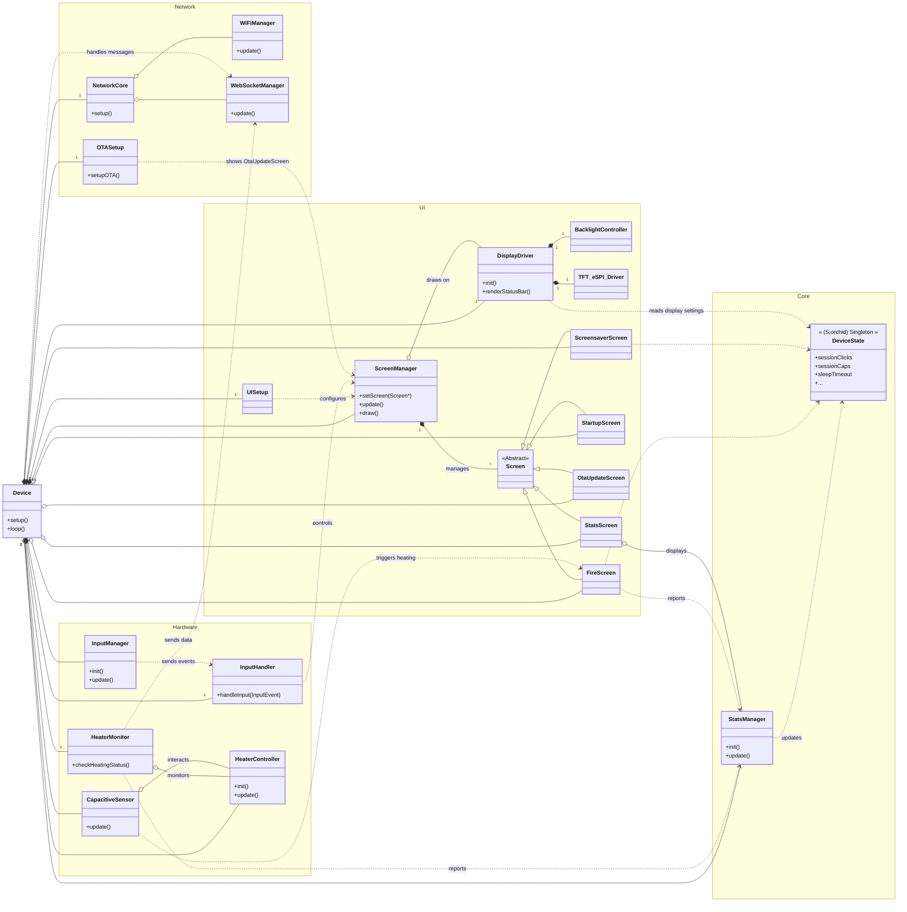

```mermaid
classDiagram
    direction LR

    class Device {
        +setup()
        +loop()
    }

    %% --- Core ---
    namespace Core {
        class DeviceState {
            << (S,orchid) Singleton >>
            +sessionClicks
            +sessionCaps
            +sleepTimeout
            +...
        }
        class StatsManager {
            +init()
            +update()
        }
    }

    %% --- UI ---
    namespace UI {
        class ScreenManager {
            +setScreen(Screen*)
            +update()
            +draw()
        }
        class DisplayDriver {
            +init()
            +renderStatusBar()
        }
        class BacklightController
        class TFT_eSPI_Driver
        class Screen {
            <<Abstract>>
        }
        class FireScreen
        class ScreensaverScreen
        class StartupScreen
        class OtaUpdateScreen
        class StatsScreen
        class UISetup
    }

    %% --- Hardware ---
    namespace Hardware {
        class InputManager {
            +init()
            +update()
        }
        class InputHandler {
            +handleInput(InputEvent)
        }
        class HeaterController {
            +init()
            +update()
        }
        class HeaterMonitor {
            +checkHeatingStatus()
        }
        class CapacitiveSensor {
            +update()
        }
    }

    %% --- Network ---
    namespace Network {
        class NetworkCore {
            +setup()
        }
        class WiFiManager {
            +update()
        }
        class WebSocketManager {
            +update()
        }
        class OTASetup {
            +setupOTA()
        }
    }

    %% --- Relationships ---
    Device o-- InputManager
    Device o-- HeaterController
    Device "1" *-- "1" DisplayDriver
    Device o-- StatsManager
    Device o-- ScreenManager
    Device "1" *-- "1" UISetup
    Device "1" *-- "1" NetworkCore
    Device "1" *-- "1" OTASetup
    Device "1" *-- "1" HeaterMonitor
    Device "1" *-- "1" InputHandler
    Device o-- CapacitiveSensor

    UISetup ..> ScreenManager : configures
    Device o-- FireScreen
    Device o-- ScreensaverScreen
    Device o-- StartupScreen
    Device o-- OtaUpdateScreen
    Device o-- StatsScreen

    ScreenManager o-- DisplayDriver : draws on
    ScreenManager "1" *-- "*" Screen : manages
    Screen <|-- FireScreen
    Screen <|-- ScreensaverScreen
    Screen <|-- StartupScreen
    Screen <|-- OtaUpdateScreen
    Screen <|-- StatsScreen

    DisplayDriver "1" *-- "1" TFT_eSPI_Driver
    DisplayDriver "1" *-- "1" BacklightController

    InputManager ..> InputHandler : sends events
    InputHandler ..> ScreenManager : controls
    HeaterMonitor o-- HeaterController : monitors
    CapacitiveSensor o-- HeaterController : interacts
    CapacitiveSensor ..> FireScreen : triggers heating

    NetworkCore o-- WiFiManager
    NetworkCore o-- WebSocketManager
    Device ..> WebSocketManager : handles messages
    OTASetup ..> ScreenManager : shows OtaUpdateScreen

    StatsManager ..> DeviceState : updates
    HeaterMonitor ..> StatsManager : reports
    FireScreen ..> StatsManager : reports
    StatsScreen o-- StatsManager : displays

    HeaterMonitor ..> WebSocketManager : sends data
    FireScreen ..> DeviceState
    ScreensaverScreen ..> DeviceState
    DisplayDriver ..> DeviceState : reads display settings

```